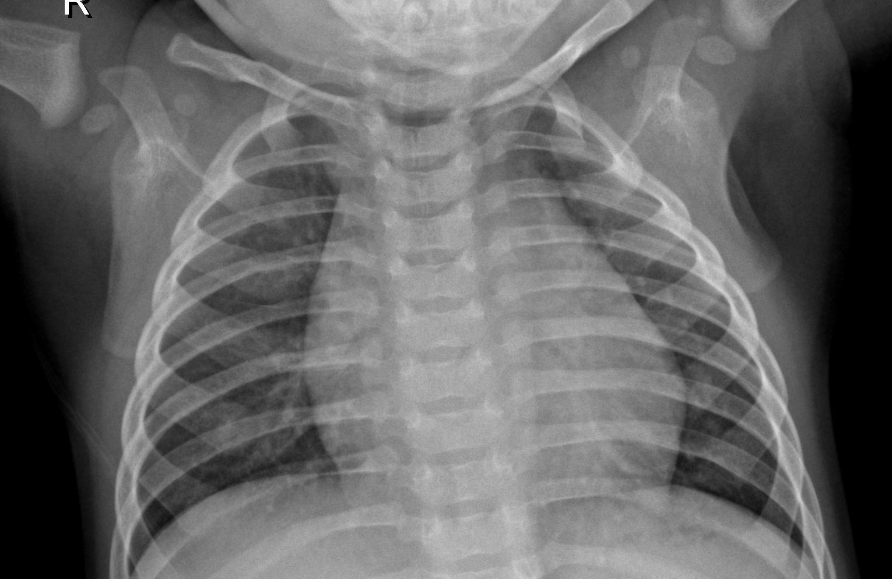
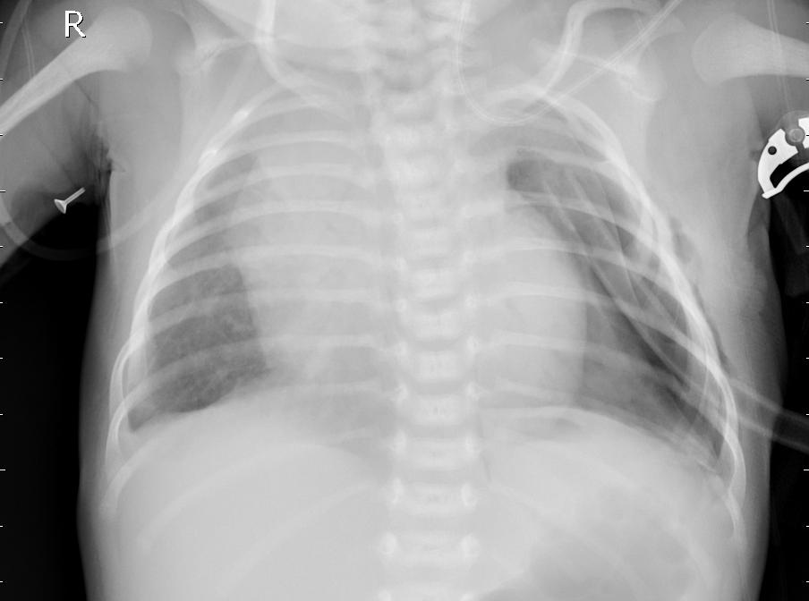
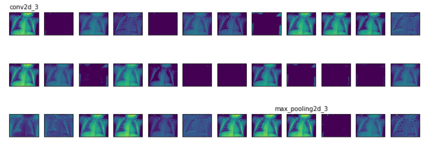

# Overview

The contents of this repo show the development of an image classification model with deep learning to identify pediatric patients' chest x-ray images as normal (pneumonia negative) or sick (pneumonia positive). The model utilizes convolutional neural networks achieving accuracy ratings of 95%. The model is also tuned to reduce the amount of false negatives so that no one suffers from the misdiagnosis.

## Problem

According to the United Nations Children's Fund (UNICEF), more than 800,000 children die of pediatric pneumonia worldwide each year. Pneumonia is an infection of the lung's air sacs (inflammation of the alveoli). The symptoms of pneumonia vary amongst affected individuals ranging from cough (with mucous), fever, shortness of breath, fatigue, nausea/vomiting, and/or confusion. Diagnosis of pneumonia requires examination of medical history, physical state, and a combination of diagnostic tests. Although a straightfoward process, infants and children are much more difficult to diagnose because they are unable to communicate and many of the diagnostic tests are invasive. On a worldwide scale, many of the tests are not as accessible because of the costs.

## X-Ray Image Classification

 <i>Example of Computer Processing</i>

Machine learning can quickly diagnose pediatric pneumonia with non-invasive x-ray imaging and image classification models. Although the process of training the models are time-consuming, the accuracies of the sophisticated models will help save time when diagnosing patients and performing further research.

### The Data

[Data](https://data.mendeley.com/datasets/rscbjbr9sj/3) consists of pediatric x-ray chest images that are presorted into training and testing directories which are each sorted into normal and pneumonia labelled directories. However, in this repo, the images are recombined and resorted in order to create a separate validation directory for model analysis.

 <i>Example of a Normal X-Ray</i>

 <i>Example of a Pneumonia X-Ray</i>

### The Model

The model is made up of convolutional layers that identify features of the image tensors that run through the filters. The images then pass through the remaining hidden layers before the classification ends.

 <i>Example of the Classification Process (CNN)</i>

The model in its final state has an accuracy rating of 86%, which is reduced at an expense of a 0.59% False Normal (false positive) prediction! It is important to make sure the model doesn't misdiagnose pneumonia patients as normal, because early intervention is key to treating pediatric pneumonia. (The model can easily be reverted back to one with an accuracy rating above 90% for research purposes.)

## Conclusion

Using X-Ray Imaging with CNN for quick, accurate, and noninvasive diagnosis can help diagnose patients as soon as an X-Ray is taken and reduce the fatality rating of global pediatric pneumonia. Building onto the model and increasing the training data overtime will only increase the model's accuracy and help support further research (such as applying to diagnosis of COVID-19 in pediatric patients).